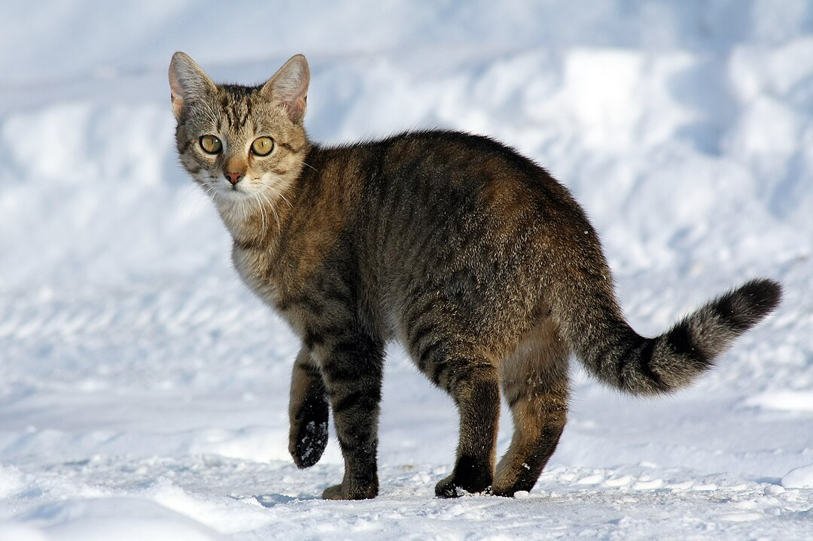

# Unified Image Similarity, Visual Search, and Top-k Retrieval Framework using SigLIP

### Author: `Dr.Amit Chougule, PhD` 
---

## Overview

This project demonstrates **image similarity detection** using **Google’s SigLIP** — a state-of-the-art **vision-language model** developed by Google Research.  

The toolkit allows you to:
1. Compare **two specific images** for similarity.  
2. Compare **all images in a folder** and find the most similar pair as well as top-k similarity. 
3. For a **query image**, Find the **most visually similar image** in given set of data.  

---

## Why SigLIP?

- **SigLIP (Sigmoid Loss for Language-Image Pre-training)** is a modern alternative to CLIP (Contrastive Language-Image Pretraining).  

- It is trained on large-scale, high-quality image-text datasets, enabling robust visual understanding.

- All models are open-source and free to use via Hugging Face’s `transformers` library.

- It generates image embeddings of size 768 (a 768-dimensional feature vector).

#### Model Architecture Summary
- **Model name:** google/siglip-base-patch16-224
- **Architecture type:** Vision Transformer (ViT-Base, Patch Size 16, Image Size 224×224)
- **Hidden size (embedding dimension):** 768
- **Number of transformer layers:** 12
- **Number of attention heads:** 12
- **Intermediate size (feed-forward dimension):** 3072
- **Image patch size:** 16×16
- **Output embedding dimension:** 768


#### Advantages of SigLIP:
- High-quality embeddings for **image-to-image similarity**.
- Works efficiently on CPUs or GPUs.
- Open and free to use (no API key required).
- Simple integration with Hugging Face `transformers`.

---

## Project Features

| Feature | Description |
|----------|-------------|
| Two-Image Comparison | Compute similarity between any two images. |
| Folder-Wide Comparison | Automatically compare all images in a folder and find the most similar pair. |
| Query-Based Search | Find the closest match in a folder to a given query image. |
| Model | Uses `google/siglip-base-patch16-224` pretrained vision-text encoder. |
| Metric | Uses **Cosine Similarity** between L2-normalized embeddings. |

---

## Conceptual Workflow

All scripts follow the following logical flow:

1. **Load Model and Processor**  
   - Uses the `AutoModel` and `AutoProcessor` classes from Hugging Face’s `transformers`.  
   - Model: `google/siglip-base-patch16-224`.

2. **Load Images**  
   - Opens images from disk using `Pillow (PIL)`.  
   - Converts all to RGB for consistency.

3. **Preprocess**  
   - Uses the `SigLIP` processor to resize, normalize, and batch images.

4. **Generate Embeddings**  
   - Extracts high-dimensional feature vectors from images using the model’s encoder.

5. **Normalize & Compare**  
   - Normalizes all embeddings using L2 normalization.  
   - Computes cosine similarity between vectors to measure visual closeness.

6. **Interpret Results**  
   - Higher cosine similarity = more visually similar images.

---

## Installation

### Requirements
This project requires **Python 3.8+** and the following packages:

```bash
	pip install torch torchvision transformers pillow matplotlib
```

To install `sentencepiece` library:

```bash
	pip install sentencepiece
```


---

## Project Strcture

```
Image_Embedding_Based_Image_Similarity_Identification
│
├── Images/                      # Folder containing your target images
│   ├── Dog_1.jpg
│   ├── Dog_2.jpg
│   ├── Dog_3.jpg
│   └── ...
│
├── Query_Image.jpg              # The query image (for query search script)
│
├── image_similarity_siglip.py   # Compare two images
├── folder_image_similarity.py   # Compare all images in a folder
├── query_image_similarity.py    # Find best match for a query image
│
└── README.md                    # This documentation file
```

---

## Sample Images

|  |  |  |
|:----------------------------:|:----------------------------:|:----------------------------:|
| **Cat_1.jpg** | **Cat_2.jpg** | **Cat_3.jpg** |

|  |  |  |
|:----------------------------:|:----------------------------:|:----------------------------:|
| **Dog_1.jpg** | **Dog_2.jpg** | **Dog_3.jpg** |

---

## Scripts Explained

#### 1️.image_similarity_siglip.py

**Purpose:** Compare two specific images and calculate their cosine similarity.

**Steps:**

- Loads two image files (e.g., Dog_1.jpg, Dog_3.jpg).
- Preprocesses and embeds both using SigLIP.
- Computes cosine similarity between embeddings.
- Prints similarity score and sample embedding values.

**Example Output:**
```
	Cosine similarity: 0.7828

	Embedding for Image 1 (first 10 dims): tensor([-0.0080,  0.0263, -0.0025, -0.0142,  0.0065, -0.0036,  0.0003, -0.0116,
	         0.0264, -0.0233])

	Embedding for Image 2 (first 10 dims): tensor([ 0.0221, -0.0246, -0.0172, -0.0048, -0.0185,  0.0113, -0.0083, -0.0261,
	         0.0244, -0.0091])

```

#### 2️.folder_image_similarity.py
**Purpose:** Automatically find the most similar pair of images within an entire folder.

**Steps:**
- Loads all image files in Images/.
- Generates embeddings for each image.
- Computes all pairwise cosine similarities.
- Identifies and prints the pair with the highest similarity.

**Example Output:**
```
	Most similar image pair:
	Dog_2.jpg  <-->  Dog_3.jpg
	Cosine similarity: 0.8718

	All pairwise similarities:
	Cat_1.jpg <-> Cat_2.jpg: 0.7875
	Cat_1.jpg <-> Cat_3.jpg: 0.8012
	Cat_1.jpg <-> Dog_1.jpg: 0.6686
	Cat_1.jpg <-> Dog_2.jpg: 0.7559
	Cat_1.jpg <-> Dog_3.jpg: 0.7289
	Cat_2.jpg <-> Cat_3.jpg: 0.8093
	Cat_2.jpg <-> Dog_1.jpg: 0.6702
	Cat_2.jpg <-> Dog_2.jpg: 0.6714
	Cat_2.jpg <-> Dog_3.jpg: 0.6816
	Cat_3.jpg <-> Dog_1.jpg: 0.6627
	Cat_3.jpg <-> Dog_2.jpg: 0.7053
	Cat_3.jpg <-> Dog_3.jpg: 0.6546
	Dog_1.jpg <-> Dog_2.jpg: 0.7776
	Dog_1.jpg <-> Dog_3.jpg: 0.7828
	Dog_2.jpg <-> Dog_3.jpg: 0.8718

	Top 3 most similar image pairs:
	1. Dog_2.jpg <-> Dog_3.jpg : 0.8718
	2. Cat_2.jpg <-> Cat_3.jpg : 0.8093
	3. Cat_1.jpg <-> Cat_3.jpg : 0.8012

```

#### 3.query_image_similarity.py

**Purpose:** Given a single query image (e.g., a product photo), find the most visually similar image in a folder.

**Steps:**
- Loads the query image (e.g., Query_Image.jpg).
- Loads all target images from Images/.
- Generates embeddings for both.
- Computes cosine similarity between the query and each folder image.
- Displays the best match and similarity score.
- Optionally shows both images side-by-side.

**Example Output:**
```
	Most similar image to query:
	Query Image: Query_Image.jpg
	Matched Image: Dog_2.jpg
	Cosine Similarity: 0.8820
```
---

## Understanding Cosine Similarity

**Cosine similarity** measures how aligned two vectors are in high-dimensional space.  
It’s a common metric for comparing embeddings (numerical feature vectors) in tasks like image or text similarity.

#### Formula

\[
\text{similarity}(A, B) = \frac{A \cdot B}{\|A\| \times \|B\|}
\]

Where:
- \( A \cdot B \) is the **dot product** of the two vectors  
- \( \|A\| \) and \( \|B\| \) are the **magnitudes (norms)** of the vectors  

#### Range

| Similarity Score | Meaning |
|------------------:|:--------|
| **+1.0** | Perfectly similar (identical direction) |
| **0.0**  | Unrelated (orthogonal) |
| **–1.0** | Completely opposite (opposite direction) |

#### Interpretation in This Project

Higher cosine similarity → more visually similar images.


---

## Uses of Image Embeddings

Image embeddings are powerful numerical representations that capture the **visual essence** of an image — such as color, texture, shape, and object composition.  

They transform raw pixel data into feature-rich vectors that can be used in a wide range of computer vision and machine learning tasks.

#### Common Applications

1. **Image Classification**  
   Use embeddings as compact features for classifying images into predefined categories (e.g., identifying whether an image contains a cat, car, or flower).

2. **Image Similarity Search**  
   Compare embeddings to find visually similar images.  
   This is especially useful in recommendation systems, digital asset management, and reverse image search.

3. **Product Recommendation / Visual Search**  
   Find **visually similar products** — for example, recommending clothing items or accessories that look alike in an e-commerce platform.

4. **Anomaly or Defect Detection**  
   Detect unusual or defective images by comparing new samples to a set of “normal” embeddings.  
   Large deviations in cosine similarity can signal potential anomalies.

5. **Clustering and Organization**  
   Group images with similar visual features together for better data organization, labeling, or exploration.


---

## Author / Contact

- **Author**: `Dr. Amit Chougule, PhD` 

- #### Email: [amitchougule121@gmail.com](mailto:amitchougule121@gmail.com)
